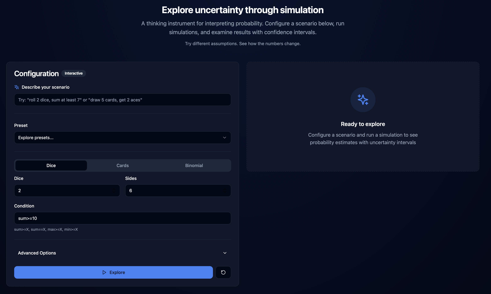
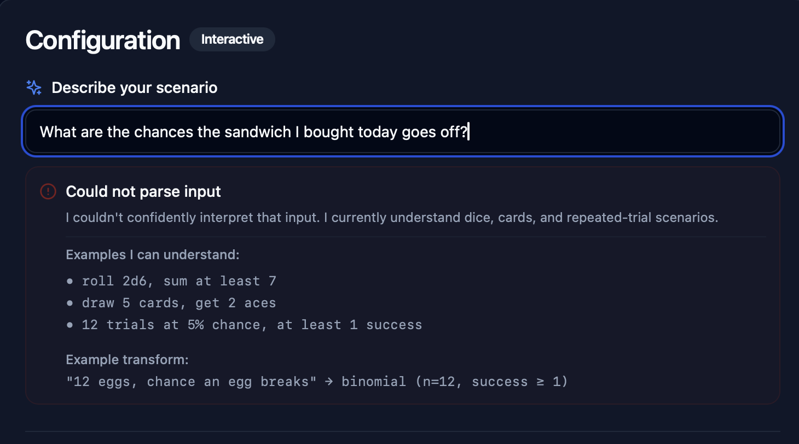
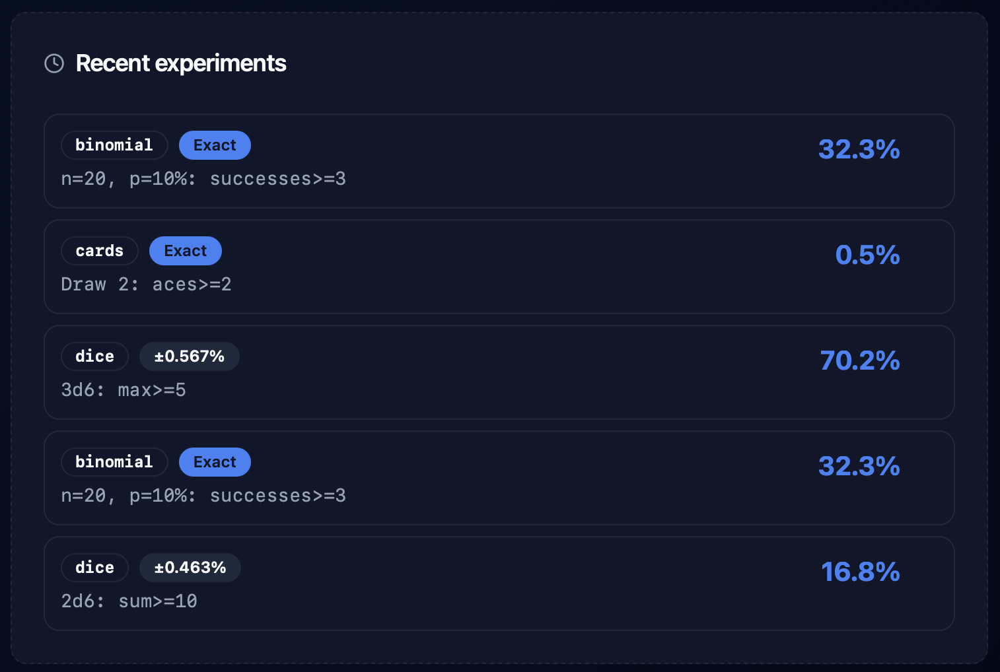

# chances-of

A thinking instrument for exploring uncertainty through simulation.

## What is this?

**chances-of** helps you interpret probability by running simulations and showing you what the numbers actually mean. Instead of trusting abstract percentages, you can see results from thousands of virtual experiments—complete with uncertainty ranges that show how confident the estimate is.

Think of it as a probability microscope: configure a scenario (rolling dice, drawing cards, repeated trials), run a simulation, and examine what happens when chance plays out thousands of times.

## What problem does it solve?

Probability is hard to reason about. Our intuitions fail us. A "30% chance" feels different depending on context, and we're bad at estimating compound probabilities (like "if I flip 10 coins, what's the chance at least 7 are heads?").

This tool doesn't give you the "right answer"—it helps you **explore assumptions**. You describe a situation, the tool simulates it, and you see both the estimated probability and the range of uncertainty. Change your assumptions, run it again, see how the numbers shift.

It's honest about what it doesn't know. When you see a result like "67.3% ± 0.8%", that interval tells you: "If we ran this simulation again, the estimate would likely fall in this range." The uncertainty is part of the answer, not a flaw.

## How Monte Carlo simulation works

Monte Carlo simulation is like running an experiment thousands of times in a computer.

Here's the process: First, you describe a random event (like rolling dice or flipping coins). The computer then simulates that event many times—10,000, 100,000, or more. It counts how often your condition is true (like "sum of dice ≥ 10"). Finally, it divides successes by total trials to estimate the probability.

The more trials you run, the more precise the estimate becomes. The tool shows you an **uncertainty interval** (also called a confidence interval) that quantifies how much the estimate might vary if you ran the simulation again. A narrow interval means high confidence; a wide interval means the estimate is less stable.

For some scenarios, the tool can also calculate **exact** probabilities using mathematical formulas—these have no simulation uncertainty at all.

## What "uncertainty interval" means

When you see a result like:

```
Probability: 16.67%
95% Uncertainty interval: 16.42% - 16.88%
```

This means: "Based on this simulation, the probability is around 16.67%. If we ran this simulation again with different random outcomes, we'd be 95% confident the estimate would fall between 16.42% and 16.88%."

**Important:** The uncertainty interval only reflects simulation randomness. It does **not** tell you whether your assumptions (like "dice are fair" or "cards are shuffled randomly") match reality. Garbage assumptions in, precise garbage out.

## Quick Start

### Installation

```bash
git clone https://github.com/builder-rapidtools/chances-of.git
cd chances-of
npm install
```

### Running the Web UI

The easiest way to use **chances-of** is through the web interface:

```bash
npm run dev
```

This starts:
- API server on `http://localhost:3001`
- Web UI on `http://localhost:3000`

Open your browser to `http://localhost:3000` and start exploring.

### Using Natural Language Input

The UI includes a natural language parser. Try typing:

- `"roll 2 dice, sum at least 7"`
- `"draw 5 cards, get 2 aces"`
- `"12 trials at 5% chance, at least 1 success"`

The tool will interpret your input, show you how it understood the scenario, and let you review before running. If it can't parse your input, it will suggest examples and show you how to reframe your question.

### Examples You Can Try

**Dice:**
- "3d6, sum at least 15"
- "roll 1 die with 20 sides, max at least 18"

**Cards:**
- "draw 7 cards, get 3 hearts"
- "draw 2 cards, any ace"

**Binomial (repeated trials):**
- "20 coin flips, at least 12 heads" (use p=0.5)
- "100 trials at 1% chance, at least 2 successes"
- "12 eggs, each has 8% break chance, at least 1 breaks"

## Web UI Features

- **Run History:** See your last 5 experiments. Click any entry to restore and re-run.
- **Natural Language Input:** Describe scenarios in plain English.
- **Interpretation Layer:** Clear explanation of what the tool understood.
- **Uncertainty Intervals:** Visual bar chart showing confidence ranges.
- **Dark Mode:** Full theme support.
- **Presets:** Load example scenarios to explore.


*Screenshot: Main interface with natural language input*


*Screenshot: Layered error message with examples*


*Screenshot: Recent experiments panel*

## Command-Line Interface

You can also use **chances-of** from the command line:

```bash
npm run build
node dist/cli.js dice --dice 2 --sides 6 --condition "sum>=10" --trials 100000
```

### CLI Examples

**Dice simulation:**
```bash
node dist/cli.js dice --dice 2 --sides 6 --condition "sum>=10" --trials 200000 --seed 42
```

**Exact card probability:**
```bash
node dist/cli.js cards --draw 2 --condition "aces>=2" --exact
```

**Binomial with adaptive sampling:**
```bash
node dist/cli.js binomial --n 20 --p 0.1 --condition "successes>=3" --target-ci-width 0.01
```

### CLI Options

- `--seed <number>`: Random seed for reproducible results (default: 42)
- `--trials <number>`: Number of Monte Carlo trials (default: 100000)
- `--target-ci-width <number>`: Target confidence interval width (activates precision-stop mode)
- `--exact`: Use exact calculation instead of simulation (cards and binomial only)
- `--json`: Output results as JSON

See the [detailed CLI documentation](#cli-reference) below for all scenarios and options.

---

## For Developers

### Project Structure

```
src/
  cli.ts                    # CLI interface
  engine/monteCarlo.ts      # Monte Carlo simulation engine
  stats/wilson.ts           # Wilson CI calculation
  util/rng.ts              # Seedable RNG (Mulberry32)
  scenarios/
    dice.ts                # Dice simulation
    cards.ts               # Cards simulation (hypergeometric)
    binomial.ts            # Binomial simulation
server/
  index.ts                 # Express API server
ui/
  main.tsx                 # React entry point
  App.tsx                  # Main app component
  components/
    ConfigPanel.tsx        # Scenario configuration with NL input
    ResultsPanel.tsx       # Results display
    HistoryPanel.tsx       # Run history
    Header.tsx             # Header with theme toggle
  lib/
    nlParser.ts            # Natural language parser (deterministic)
    presets.ts             # Example scenarios
test/
  *.test.ts                # Vitest test suite
```

### Development Scripts

- `npm run build` - Compile TypeScript
- `npm test` - Run test suite (32 tests)
- `npm run dev` - Run API + UI dev servers concurrently
- `npm run dev:api` - Run API server only (watch mode)
- `npm run dev:ui` - Run Vite UI dev server only

### Tech Stack

**Backend:**
- TypeScript
- Express (API server)
- Vitest (testing)

**Frontend:**
- React 18
- TypeScript
- Vite
- Tailwind CSS
- shadcn/ui components
- No external API dependencies (runs locally)

### API Endpoint

**POST** `/api/run`

Request:
```json
{
  "scenario": "dice|cards|binomial",
  "params": {
    "dice": 2,
    "sides": 6,
    "condition": "sum>=10"
  },
  "options": {
    "seed": 42,
    "trials": 100000,
    "exact": false
  }
}
```

Response:
```json
{
  "scenario": "dice",
  "params": { "dice": 2, "sides": 6, "condition": "sum>=10" },
  "trials": 100000,
  "successes": 16649,
  "probability": 0.16649,
  "ci_low": 0.16424,
  "ci_high": 0.16876,
  "exact": false,
  "time_ms": 45,
  "stop_reason": null
}
```

---

## CLI Reference

### Dice Scenario

Simulate rolling dice and checking conditions.

```bash
node dist/cli.js dice --dice <number> --sides <number> --condition <condition> [options]
```

**Conditions:**
- `sum>=X` - Sum of all dice ≥ X
- `sum==X` - Sum equals X
- `max>=X` - Highest die ≥ X
- `min>=X` - Lowest die ≥ X

**Example:**
```bash
node dist/cli.js dice --dice 2 --sides 6 --condition "sum>=10" --trials 200000
```

### Cards Scenario

Simulate drawing cards from a standard 52-card deck (without replacement).

```bash
node dist/cli.js cards --draw <number> --condition <condition> [options]
```

**Conditions:**
- `aces>=k` - At least k aces
- `hearts>=k` - At least k hearts
- `any_rank=K` - At least one card of rank (A, 2-10, J, Q, K)
- `any_suit=hearts` - At least one card of suit

**Exact mode** supported for `aces>=k` and `hearts>=k` using hypergeometric distribution.

**Example:**
```bash
node dist/cli.js cards --draw 5 --condition "hearts>=3" --exact
```

### Binomial Scenario

Simulate n independent trials with success probability p.

```bash
node dist/cli.js binomial --n <number> --p <probability> --condition <condition> [options]
```

**Conditions:**
- `successes>=X` - At least X successes
- `successes==X` - Exactly X successes

**Exact mode** supported using binomial distribution formula.

**Example:**
```bash
node dist/cli.js binomial --n 20 --p 0.1 --condition "successes>=3" --exact
```

### Precision-Stop Mode

Adaptive sampling: runs trials until confidence interval width reaches target.

```bash
node dist/cli.js dice --dice 1 --sides 6 --condition "sum>=6" --target-ci-width 0.02
```

If both `--trials` and `--target-ci-width` are specified, `--target-ci-width` takes precedence.

## Technical Details

### Random Number Generator

Uses **Mulberry32** seedable PRNG for deterministic, reproducible results. Same seed always produces same results.

### Confidence Intervals

Calculates 95% confidence intervals using the **Wilson score method**, which is more accurate than normal approximation for:
- Small sample sizes
- Probabilities near 0 or 1

Intervals are always clamped to [0, 1].

### Exact Calculations

**Cards (Hypergeometric Distribution):**

For `aces>=k` and `hearts>=k`:
```
P(X ≥ k) = Σ C(K,x) × C(N-K, n-x) / C(N,n)
```
where N=52, K=4 (aces) or 13 (hearts), n=cards drawn.

**Binomial Distribution:**

For `successes>=k`:
```
P(X ≥ k) = Σ C(n,x) × p^x × (1-p)^(n-x)
```

For `successes==k`:
```
P(X = k) = C(n,k) × p^k × (1-p)^(n-k)
```

## Limitations

- Cards scenario only supports standard 52-card deck
- Exact mode for cards only supports `aces>=k` and `hearts>=k`
- Maximum trials capped at 5,000,000 in precision-stop mode
- All calculations use floating-point arithmetic (no arbitrary precision)
- Natural language parser is deterministic (regex-based, not LLM)

## Deployment Notes

### Static Site Deployment (Cloudflare Pages, etc.)

**Current limitation:** The Web UI currently depends on a Node.js API server running at `http://localhost:3001`. This means it cannot be deployed as a static site without modifications.

**To support static deployment**, you would need to:
1. Bundle the probability engine (`src/scenarios/*`, `src/engine/*`) as a WebAssembly module or JavaScript library
2. Run simulations in the browser (Web Workers recommended for performance)
3. Remove the API server dependency from the UI

This is **not implemented** in v1.2.0. The current version requires both the API server and UI dev server to run concurrently.

## Release History

- **v1.2.0** (2025-12-29) - UI upgrades: run history, natural language input, microcopy polish
- **v1.1.0-ui** (2025-12-29) - UI redesign with Tailwind + shadcn/ui
- **v1.0.0** - Initial release with CLI and basic Web UI

## License

MIT

---

## Contributing

This is a personal tool built for honest probability exploration. Pull requests welcome, but keep these principles:

- **No marketing language** - Calm, factual tone
- **Uncertainty is not a bug** - Show it, explain it, embrace it
- **Simple over clever** - Readable code beats premature optimization
- **No LLM dependencies** - Deterministic parsing, local execution

## Questions?

- **"Why not use an LLM for natural language parsing?"** - LLMs are non-deterministic and add dependency bloat. A regex-based parser is predictable, fast, and runs offline.
- **"Why show uncertainty intervals?"** - Because the interval is part of the answer. Hiding it would be dishonest.
- **"Can I use this for real decision-making?"** - Only if you understand your assumptions. This tool simulates your model, not reality.

---

Built with honesty about what numbers mean.
